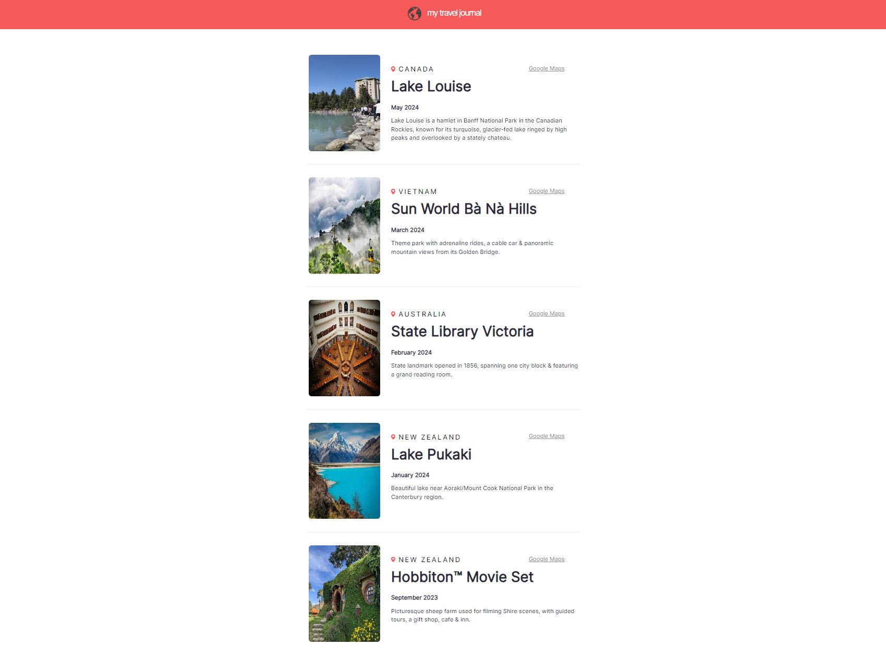

# Travel Journal
A simple travel journal created with React (JS), with a log of places visited

[Live Demo](https://yuneychonlee.github.io/travel-journal/)

## Run project
In the project root directory, run:
`npm start`  
Open http://localhost:3000 to view it in your browser.